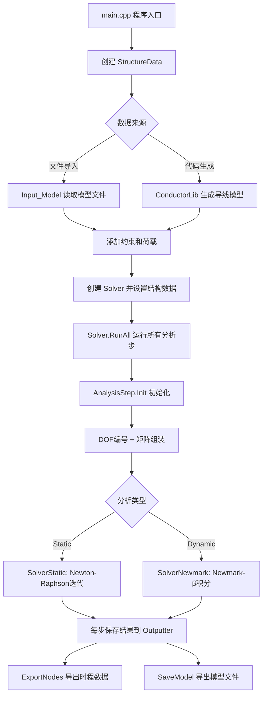

# YQY_CAE 项目说明文档

## 项目概述

YQY_CAE 是一个基于 C++/Qt 的有限元分析（FEA）程序，专注于架空输电线路结构分析。项目支持静力分析和动力分析，采用模块化设计，具有良好的扩展性。

**核心功能：**
- 静力/动力有限元分析
- 架空导线建模（单根、分裂导线、间隔棒）
- 多种单元类型（桁架、索、梁）
- 气动参数管理
- 结果导出与可视化

---

## 1. 项目文件说明

### 1.1 .vcxproj.filters 作用

Visual Studio 中的筛选器文件，用于在解决方案资源管理器中显示虚拟文件夹结构。

> [!NOTE]
> 筛选器仅用于 IDE 中的显示分类，不影响实际文件系统结构。

### 1.2 .vcxproj

Visual Studio 项目文件，包含：
- 编译器选项（优化级别、警告等）
- 链接器配置
- 依赖库路径
- 预处理器定义
- 包含目录

### 1.3 ThirdPartyLibrary 三方库配置

**配置步骤：**
1. 将三方库文件夹放置在 D 盘根目录
2. 在 VS 属性管理器中选择对应的配置（Debug/Release）
3. 右键 → 添加现有属性表
4. 选择三方库文件夹中对应的 `.props` 文件

**依赖库：**
- **Qt** - GUI 框架和基础工具类
- **Eigen** - 线性代数库（稀疏矩阵求解器）

---

## 2. 目录结构

```
YQY/
├── main.cpp                    # 程序入口
├── Base/                       # 基类模块
│   └── Base.h                  # 所有数据结构的公共基类（包含ID）
├── DataStructure/              # 数据结构模块
│   ├── Node/                   # 节点（坐标、位移、速度、加速度）
│   ├── Element/                # 单元（Truss/Cable/Beam）
│   │   ├── ElementBase.h       # 单元基类（刚度、质量、阻尼矩阵）
│   │   ├── ElementTruss.h      # 桁架单元（2节点，轴力）
│   │   ├── ElementCable.h      # 索单元（2节点，仅拉力）
│   │   └── ElementBeam.h       # 梁单元（2节点，弯矩）
│   ├── Material/               # 材料（弹性模量、密度等）
│   ├── Section/                # 截面（面积、惯性矩）
│   ├── Property/               # 属性（材料+截面组合）
│   ├── Constraint/             # 约束（边界条件）
│   ├── Load/                   # 荷载（节点力、单元荷载、重力、风荷载）
│   ├── AnalysisStep/           # 分析步（控制求解流程）
│   └── Structure/              # 结构数据容器（管理所有数据）
├── Solver/                     # 求解器模块
│   ├── Interface/              # 求解器接口（ISolver、IAnalysisModel）
│   ├── Static/                 # 静力求解器（Newton-Raphson）
│   └── Dynamic/                # 动力求解器（Newmark-β）
├── Import/                     # 文件导入模块
│   ├── Input_Model.h           # 模型文件读取器
│   ├── FileFormat.md           # 输入文件格式说明
│   ├── AeroManager.h           # 气动参数管理器
│   └── ImportFile/             # 测试输入文件
├── Export/                     # 结果导出模块
│   ├── Outputter.h             # 输出管理器（时程数据）
│   └── ExportFile/             # 导出结果文件
├── GUI/                        # 图形界面模块（Qt）
├── Utility/                    # 工具类模块
│   ├── ModelManager.h          # 模型管理器（单例）
│   └── EnumKeyword.h           # 关键字枚举定义
├── Conductor/                  # 导线生成模块
│   └── ConductorLib.h          # 导线建模库（分裂导线、间隔棒）
└── TestData/                   # 测试数据
```

---

## 3. 核心模块说明

### 3.1 基类模块 (Base)

#### 3.1.1 Base - 公共基类

文件：[Base/Base.h](YQY/Base/Base.h)

所有数据结构的公共基类，提供统一的 ID 管理。

```cpp
class Base {
public:
    int m_Id;  // 对象唯一标识符
    virtual ~Base() = default;  // 虚析构函数
};
```

**继承关系：**
- Node → Base
- ElementBase → Base
- Material → Base
- SectionBase → Base
- Property → Base
- Constraint → Base
- LoadBase → Base

---

### 3.2 数据结构模块 (DataStructure)

#### 3.2.1 StructureData - 结构数据容器

文件：[DataStructure/Structure/StructureData.h](YQY/DataStructure/Structure/StructureData.h)

整个有限元模型的核心数据管理类，使用 `std::map` 存储所有数据对象。

**数据成员：**

| 成员变量 | 类型 | 说明 |
|---------|------|------|
| `m_Nodes` | `map<int, shared_ptr<Node>>` | 节点集合（ID → 节点） |
| `m_Elements` | `map<int, shared_ptr<ElementBase>>` | 单元集合（ID → 单元） |
| `m_Material` | `map<int, shared_ptr<Material>>` | 材料集合（ID → 材料） |
| `m_Section` | `map<int, shared_ptr<SectionBase>>` | 截面集合（ID → 截面） |
| `m_Property` | `map<int, shared_ptr<Property>>` | 属性集合（ID → 属性） |
| `m_Constraint` | `map<int, shared_ptr<Constraint>>` | 约束集合（ID → 约束） |
| `m_Load` | `map<int, shared_ptr<LoadBase>>` | 荷载集合（ID → 荷载） |
| `m_AnalysisStep` | `map<int, shared_ptr<AnalysisStep>>` | 分析步集合（ID → 分析步） |

**主要方法：**

```cpp
// 查找方法
std::weak_ptr<Node> FindNode(int id);
std::weak_ptr<ElementBase> FindElement(int id);
std::weak_ptr<Material> FindMaterial(int id);

// 创建方法
std::weak_ptr<Property> Create_Property(int id_material, int id_section);
void Add_Property(double E, double rho, double A);  // 快速创建属性

// 添加约束和荷载
void Add_Constraint(std::vector<int> nodeIds, std::vector<int> directions, std::vector<double> values);
void Add_Gravity(int direction, double scale);  // 添加重力荷载

// 分析步管理
void Add_AnalysisStep(QString type, double time, double stepSize, double tolerance, int maxIter);

// 模型处理
void CleanupModel(double tolerance);  // 合并重复节点、清理无效数据

// 结果输出
Outputter& GetOutputter();  // 获取输出管理器
```

#### 3.2.2 Node - 节点类

文件：[DataStructure/Node/Node.h](YQY/DataStructure/Node/Node.h)

存储节点的几何位置和力学状态。

**数据成员：**
- `m_X, m_Y, m_Z` - 节点坐标
- `m_Displacement` - 位移向量（平动 + 转角）
- `m_Velocity` - 速度向量
- `m_Acceleration` - 加速度向量
- `m_Force` - 节点力/反力向量
- `m_DOF` - 自由度编号数组

#### 3.2.3 ElementBase - 单元基类

文件：[DataStructure/Element/ElementBase.h](YQY/DataStructure/Element/ElementBase.h)

所有单元类型的公共基类，定义单元的基本行为。

**数据成员：**
```cpp
QVector<std::weak_ptr<Node>> m_pNode;       // 节点指针数组
std::weak_ptr<Property>      m_pProperty;   // 属性（材料+截面）
double L0;                                  // 单元初始长度
double m_InitStress;                        // 初始应力
double m_Stress;                            // 当前应力

MatrixXd me;  // 单元质量矩阵
MatrixXd ke;  // 单元刚度矩阵
MatrixXd ce;  // 单元阻尼矩阵
VectorXd m_inforce;  // 单元内力向量
```

**虚函数接口：**
```cpp
virtual int Get_NodeDOF() const = 0;           // 获取节点自由度数
virtual void Get_ke() = 0;                     // 计算线性刚度矩阵
virtual void Get_ke_non() = 0;                 // 计算非线性刚度矩阵
virtual void Get_me_Lumped() = 0;              // 计算集中质量矩阵
virtual void Get_me_Consistent() = 0;          // 计算一致质量矩阵
virtual void Get_L0() = 0;                     // 计算初始长度
virtual void Assemble(double trans_m, double trans_k, 
                     double rot_m, double rot_k) = 0;  // 组装矩阵
```

#### 3.2.4 单元类型

| 文件 | 类名 | 说明 | 自由度/节点 |
|------|------|------|------------|
| `ElementTruss.h` | `ElementTruss` | 桁架单元（只承受轴力） | 3 (UX, UY, UZ) |
| `ElementCable.h` | `ElementCable` | 索单元（只承受拉力，不承受压力） | 3 (UX, UY, UZ) |
| `ElementBeam.h` | `ElementBeam` | 梁单元（可承受弯矩和剪力） | 6 (UX, UY, UZ, RX, RY, RZ) |

**单元特性对比：**
- **Truss**：双向轴力，线性刚度
- **Cable**：仅拉力，受压时刚度为零（非线性）
- **Beam**：轴力 + 弯矩 + 剪力，考虑转动自由度

#### 3.2.5 荷载类型 (Load)

| 文件 | 类名 | 说明 |
|------|------|------|
| `Force_Node.h` | `Force_Node` | 节点集中力荷载（支持时间窗口和时程函数） |
| `Force_Element.h` | `Force_Element` | 单元分布荷载 |
| `Force_Gravity.h` | `Force_Gravity` | 重力荷载（自动计算质量） |
| `Force_Wind.h` | `Force_Wind` | 风荷载（基于气动参数） |

**Force_Node 时程荷载功能：**

节点力荷载支持时间窗口控制和多种时程函数类型，可以模拟复杂的动态加载过程。

**主要参数：**
```cpp
class Force_Node : public LoadBase {
    int m_NodeID;           // 节点编号
    int m_Direction;        // 荷载方向（0=X, 1=Y, 2=Z）
    double m_Value;         // 荷载基准值
    int m_StepID;           // 所属分析步
    double m_StartTime;     // 起始时间
    double m_EndTime;       // 结束时间
    LoadTimeType m_Type;    // 时程类型（RAMP/SINE/STEP）
    double m_Param1;        // 参数1
    double m_Param2;        // 参数2
};
```

**时程函数类型：**

1. **RAMP（斜坡函数）**
   - 线性变化荷载
   - 适用于逐步加载、冲击模拟
   - 计算公式：`F(t) = Value × [Param1 + (Param2 - Param1) × (t - StartTime) / (EndTime - StartTime)]`

2. **SINE（正弦函数）**
   - 周期性荷载
   - 适用于振动激励、风荷载模拟
   - 计算公式：`F(t) = Value × sin(2π × Param1 × t + Param2)`

3. **STEP（阶跃函数）**
   - 恒定荷载
   - 适用于突加荷载、持续荷载
   - 计算公式：`F(t) = Value`（在时间窗口内）

**时间窗口控制：**
- 荷载仅在 `[StartTime, EndTime]` 区间内作用
- 超出时间窗口时，荷载值为0
- 可以模拟移动荷载、分段加载等复杂工况

**应用示例：**
```cpp
// 示例1：0-2s内线性增加到50%荷载
Force_Node load1;
load1.m_Value = 1000.0;
load1.m_StartTime = 0.0;
load1.m_EndTime = 2.0;
load1.m_Type = LoadTimeType::RAMP;
load1.m_Param1 = 0.0;   // 起始系数
load1.m_Param2 = 0.5;   // 结束系数

// 示例2：2Hz正弦激励，持续10秒
Force_Node load2;
load2.m_Value = 5000.0;
load2.m_StartTime = 0.0;
load2.m_EndTime = 10.0;
load2.m_Type = LoadTimeType::SINE;
load2.m_Param1 = 2.0;   // 频率2Hz
load2.m_Param2 = 0.0;   // 相位角0
```

#### 3.2.6 AnalysisStep - 分析步

文件：[DataStructure/AnalysisStep/AnalysisStep.h](YQY/DataStructure/AnalysisStep/AnalysisStep.h)

负责单次分析的完整流程，实现 `Solver::IAnalysisModel` 接口。

**主要参数：**
```cpp
AnalysisType m_Type;        // 分析类型（Static/Dynamic）
double m_Time;              // 总时间
double m_StepSize;          // 时间步长
double m_Tolerance;         // 收敛容差
int m_MaxIterations;        // 最大迭代次数
```

**主要方法：**
```cpp
void Init();                // 初始化（DOF编号、矩阵组装）
void Solve();               // 根据类型调度求解
void Solve_Static();        // 静力求解
void Solve_Dynamic();       // 动力求解（调用 SolverNewmark）
```

**工作流程：**
1. `Init()` - 为所有节点分配 DOF 编号
2. 组装全局刚度矩阵 K、质量矩阵 M
3. 根据分析类型调用对应求解器
4. 保存结果到 Outputter

---

### 3.3 求解器模块 (Solver)

#### 3.3.1 ISolver - 求解器接口

文件：[Solver/Interface/ISolver.h](YQY/Solver/Interface/ISolver.h)

统一的求解器接口，所有求解器都继承此接口。

```cpp
class ISolver {
public:
    virtual bool Solve(IAnalysisModel& model, double duration) = 0;
    virtual const char* GetName() const = 0;
    virtual SolverType GetType() const = 0;
};
```

**求解器类型枚举：**
```cpp
enum class SolverType {
    Static,              // 静力 Newton-Raphson
    Newmark,             // Newmark-β 隐式动力
    CentralDifference,   // 中心差分显式动力（预留）
    HHT                  // HHT-α 隐式动力（预留）
};
```

#### 3.3.2 SolverStatic - 静力求解器

文件：[Solver/Static/SolverStatic.h](YQY/Solver/Static/SolverStatic.h)

采用 **Newton-Raphson 迭代法** 进行非线性静力分析。

**算法流程：**
1. 初始化位移 u = 0
2. 计算残差 R = F_ext - F_int
3. 组装切线刚度矩阵 K_T
4. 求解增量 Δu = K_T^(-1) * R
5. 更新位移 u = u + Δu
6. 检查收敛：||R|| < tolerance
7. 未收敛则返回步骤 2

**适用场景：**
- 几何非线性（大变形）
- 材料非线性（索单元只受拉）
- 初应力问题

#### 3.3.3 SolverNewmark - 动力求解器

文件：[Solver/Dynamic/SolverNewmark.h](YQY/Solver/Dynamic/SolverNewmark.h)

采用 **Newmark-β 隐式积分方法** 进行动力分析。

**Newmark 参数：**
- β = 0.25（平均加速度法，无条件稳定）
- γ = 0.5

**算法流程：**
```
对于每个时间步 t → t+Δt：
1. 预测加速度和速度
2. 组装有效刚度矩阵：K_eff = K + a0*M + a1*C
3. 计算有效荷载：F_eff = F(t+Δt) + M*(a0*u + a2*v + a3*a) + C*(a1*u + a4*v + a5*a)
4. 求解位移：u(t+Δt) = K_eff^(-1) * F_eff
5. 修正速度和加速度
6. 保存结果
```

**适用场景：**
- 结构动力响应分析
- 地震响应分析
- 风振响应分析

---

### 3.4 文件导入模块 (Import)

#### 3.4.1 Input_Model - 模型输入类

文件：[Import/Input_Model.h](YQY/Import/Input_Model.h)

负责从文本文件读取有限元模型数据。

**主要方法：**
```cpp
bool InputData(QString fileName, std::shared_ptr<StructureData> pStructure);
```

**内部处理函数：**
- `InputNodes(...)` - 读取节点坐标
- `InputElement(...)` - 读取单元（自动分发到具体单元类型）
- `InputMaterial(...)` - 读取材料参数
- `InputSection(...)` - 读取截面参数
- `InputConstraint(...)` - 读取边界约束
- `InputLoad(...)` - 读取荷载（自动分发到具体荷载类型）
- `InputAnalysisStep(...)` - 读取分析步配置

**文件解析特性：**
- 支持注释行（`**` 或 `//` 开头）
- 支持多种分隔符（空格、Tab、逗号）
- 自动跳过空行
- 关键字不区分大小写

#### 3.4.2 输入文件格式详解

详见：[Import/FileFormat.md](YQY/Import/FileFormat.md)

**文件格式规则：**
- 关键字行以 `*` 开头
- 注释行以 `**` 或 `//` 开头
- 数据字段支持空格、Tab、逗号分隔
- 空行自动跳过

---

##### 1. 节点定义 (*NODE)

**格式：**
```
*NODE, 数量
ID(节点编号)  X(X坐标)  Y(Y坐标)  Z(Z坐标)
```

**字段说明：**
| 变量名 | 中文名称 | 类型 | 单位 | 说明 |
|--------|---------|------|------|------|
| ID | 节点编号 | 整数 | - | 节点的唯一标识符 |
| X | X坐标 | 浮点数 | m | 节点在全局坐标系X方向的位置 |
| Y | Y坐标 | 浮点数 | m | 节点在全局坐标系Y方向的位置 |
| Z | Z坐标 | 浮点数 | m | 节点在全局坐标系Z方向的位置 |

**示例：**
```
*NODE, 3
1   0.0   0.0   0.0    ** 节点1：原点
2   1.0   0.0   0.0    ** 节点2：X方向1米
3   2.0   0.0   0.0    ** 节点3：X方向2米
```

---

##### 2. 材料定义 (*MATERIAL)

**格式：**
```
*MATERIAL, 数量
ID(材料编号)  E(弹性模量)  ν(泊松比)  ρ(密度)  σ_allow(许用应力)  α(热膨胀系数)
```

**字段说明：**
| 变量名 | 中文名称 | 类型 | 单位 | 说明 |
|--------|---------|------|------|------|
| ID | 材料编号 | 整数 | - | 材料的唯一标识符 |
| E | 弹性模量 | 浮点数 | Pa | 材料的弹性模量，如钢材 2.1e11 |
| ν | 泊松比 | 浮点数 | - | 材料的泊松比，范围 0-0.5 |
| ρ | 密度 | 浮点数 | kg/m³ | 材料密度，用于计算质量和重力 |
| σ_allow | 许用应力 | 浮点数 | Pa | 材料的许用应力（可选） |
| α | 热膨胀系数 | 浮点数 | 1/K | 线性热膨胀系数（可选） |

**示例：**
```
*MATERIAL, 2
1   2.1e+11   0.3   7850   200e6   1.2e-5    ** 钢材：E=210GPa, ρ=7850kg/m³
2   7.0e+10   0.3   2700   150e6   2.3e-5    ** 铝材：E=70GPa, ρ=2700kg/m³
```

---

##### 3. 截面定义 (*SECTION)

**格式：**
```
*SECTION, 数量
ID(截面编号)  A(面积)  [Iy(Y轴惯性矩)  Iz(Z轴惯性矩)  J(扭转惯性矩)]
```

**字段说明：**
| 变量名 | 中文名称 | 类型 | 单位 | 说明 |
|--------|---------|------|------|------|
| ID | 截面编号 | 整数 | - | 截面的唯一标识符 |
| A | 截面面积 | 浮点数 | m² | 截面的横截面积 |
| Iy | Y轴惯性矩 | 浮点数 | m⁴ | 绕Y轴的惯性矩（梁单元需要） |
| Iz | Z轴惯性矩 | 浮点数 | m⁴ | 绕Z轴的惯性矩（梁单元需要） |
| J | 扭转惯性矩 | 浮点数 | m⁴ | 抗扭惯性矩（梁单元需要） |

**示例：**
```
*SECTION, 2
1   0.01                           ** 桁架/索单元：仅需面积A
2   0.01   8.33e-6   8.33e-6   0   ** 梁单元：需要A, Iy, Iz, J
```

---

##### 4. 单元定义 (*ELEMENT)

**格式：**
```
*ELEMENT, Type(单元类型), 数量
ID(单元编号)  Node1(起点节点)  Node2(终点节点)  MaterialID(材料编号)  SectionID(截面编号)
```

**字段说明：**
| 变量名 | 中文名称 | 类型 | 可选值 | 说明 |
|--------|---------|------|--------|------|
| Type | 单元类型 | 字符串 | T3D2/CABLE/B31 | T3D2=桁架, CABLE=索, B31=梁 |
| ID | 单元编号 | 整数 | - | 单元的唯一标识符 |
| Node1 | 起点节点 | 整数 | - | 单元起点的节点编号 |
| Node2 | 终点节点 | 整数 | - | 单元终点的节点编号 |
| MaterialID | 材料编号 | 整数 | - | 引用的材料编号 |
| SectionID | 截面编号 | 整数 | - | 引用的截面编号 |

**单元类型说明：**
- **T3D2（桁架单元）**：只承受轴向拉压力，不承受弯矩
- **CABLE（索单元）**：只承受拉力，受压时刚度为零
- **B31（梁单元）**：可承受轴力、剪力和弯矩

**示例：**
```
*ELEMENT, T3D2, 2
1   1   2   1   1    ** 桁架单元：节点1到节点2
2   2   3   1   1    ** 桁架单元：节点2到节点3

*ELEMENT, CABLE, 1
3   3   4   1   1    ** 索单元：只受拉

*ELEMENT, B31, 1
4   4   5   1   2    ** 梁单元：考虑弯曲
```

---

##### 5. 约束定义 (*CONSTRAINT)

**格式：**
```
*CONSTRAINT, 数量
ID(约束编号)  NodeID(节点编号)  Direction(约束方向)  Value(约束值)
```

**字段说明：**
| 变量名 | 中文名称 | 类型 | 单位 | 说明 |
|--------|---------|------|------|------|
| ID | 约束编号 | 整数 | - | 约束的唯一标识符 |
| NodeID | 节点编号 | 整数 | - | 被约束的节点编号 |
| Direction | 约束方向 | 整数 | - | 约束的自由度方向（见下表） |
| Value | 约束值 | 浮点数 | m 或 rad | 约束的位移值（通常为0表示固定） |

**约束方向编码 (Direction)：**
| 代码 | 变量含义 | 中文名称 | 说明 |
|------|---------|---------|------|
| 0 | UX | X方向平动 | 限制X方向的位移 |
| 1 | UY | Y方向平动 | 限制Y方向的位移 |
| 2 | UZ | Z方向平动 | 限制Z方向的位移 |
| 3 | RX | 绕X轴转动 | 限制绕X轴的转角（梁单元） |
| 4 | RY | 绕Y轴转动 | 限制绕Y轴的转角（梁单元） |
| 5 | RZ | 绕Z轴转动 | 限制绕Z轴的转角（梁单元） |

**示例：**
```
*CONSTRAINT, 6
1   1   0   0    ** 节点1：X方向固定 (UX=0)
2   1   1   0    ** 节点1：Y方向固定 (UY=0)
3   1   2   0    ** 节点1：Z方向固定 (UZ=0) → 完全固定
4   5   0   0    ** 节点5：X方向固定 (UX=0)
5   5   1   0    ** 节点5：Y方向固定 (UY=0)
6   5   2   0    ** 节点5：Z方向固定 (UZ=0) → 完全固定
```

---

##### 6. 荷载定义 (*LOAD)

**6.1 节点力荷载 (FORCE_NODE)**

**格式：**
```
*LOAD, FORCE_NODE, 数量
ID(荷载编号)  NodeID(节点编号)  Direction(荷载方向)  Value(荷载大小)  [StepID(分析步编号)  StartTime(起始时间)  EndTime(结束时间)  LoadType(荷载类型)  Param1  Param2]
```

**字段说明：**
| 变量名 | 中文名称 | 类型 | 单位 | 说明 |
|--------|---------|------|------|------|
| ID | 荷载编号 | 整数 | - | 荷载的唯一标识符 |
| NodeID | 节点编号 | 整数 | - | 施加荷载的节点编号 |
| Direction | 荷载方向 | 整数 | - | 0=X方向(FX), 1=Y方向(FY), 2=Z方向(FZ) |
| Value | 荷载大小 | 浮点数 | N | 荷载值，正值为正方向，负值为负方向 |
| StepID | 分析步编号 | 整数 | - | 荷载所属的分析步（可选） |
| StartTime | 起始时间 | 浮点数 | s | 荷载开始作用的时间（可选，默认0） |
| EndTime | 结束时间 | 浮点数 | s | 荷载结束作用的时间（可选，默认为分析步总时长） |
| LoadType | 荷载类型 | 字符串 | - | 荷载时程函数类型（可选）：RAMP（斜坡）、SINE（正弦）、STEP（阶跃） |
| Param1 | 参数1 | 浮点数 | - | 荷载类型相关参数（如RAMP的起始值） |
| Param2 | 参数2 | 浮点数 | - | 荷载类型相关参数（如RAMP的结束值） |

**荷载时程类型说明：**

1. **RAMP（斜坡荷载）**
   - 在指定时间窗口内线性变化
   - Param1：起始时刻的荷载系数（如0.0表示从0开始）
   - Param2：结束时刻的荷载系数（如0.5表示达到50%荷载）
   - 公式：F(t) = Value × [Param1 + (Param2 - Param1) × (t - StartTime) / (EndTime - StartTime)]

2. **SINE（正弦荷载）**
   - 正弦波形荷载
   - Param1：频率（Hz）
   - Param2：相位角（弧度）
   - 公式：F(t) = Value × sin(2π × Param1 × t + Param2)

3. **STEP（阶跃荷载）**
   - 在时间窗口内保持恒定值
   - 不需要额外参数

**示例1：基本节点力荷载（全程作用）**
```
*LOAD, FORCE_NODE, 3
1   2   0   10000     ** 节点2：X方向 +10kN (FX=10000N)，全程作用
2   2   1   -5000     ** 节点2：Y方向 -5kN (FY=-5000N)，全程作用
3   3   2   -20000    ** 节点3：Z方向 -20kN (FZ=-20000N，向下)，全程作用
```

**示例2：时间窗口荷载**
```
*LOAD, FORCE_NODE, 2
1   3   1   1000.0   1   0.0   2.0    ** 节点3，Y方向，1000N，只在0-2s作用
2   2   1   500.0    1   0.0   3.0    ** 节点2，Y方向，500N，全程作用（0-3s）
```

**示例3：斜坡荷载（RAMP）**
```
*LOAD, FORCE_NODE, 1
1   3   1   1000.0   1   0.0   1.0   RAMP   0.0   0.5
** 节点3，Y方向，1000N基准值
** 在0-1s内从0线性增加到500N（0.5×1000N）
** 时间窗口：0-1s
```

**示例4：正弦荷载（SINE）**
```
*LOAD, FORCE_NODE, 1
1   5   2   5000.0   1   0.0   10.0   SINE   2.0   0.0
** 节点5，Z方向，5000N幅值
** 频率2Hz，相位角0
** 在0-10s内作用正弦荷载：F(t) = 5000 × sin(4π × t)
```

**时间窗口荷载的应用场景：**
- 模拟短时冲击荷载
- 分段加载过程
- 移动荷载
- 周期性激励
- 地震波输入

---

**6.2 单元荷载 (FORCE_ELEMENT)**

**格式：**
```
*LOAD, FORCE_ELEMENT, 数量
ID(荷载编号)  ElementID(单元编号)  Direction(荷载方向)  Value(单位长度荷载)
```

**字段说明：**
| 变量名 | 中文名称 | 类型 | 单位 | 说明 |
|--------|---------|------|------|------|
| ID | 荷载编号 | 整数 | - | 荷载的唯一标识符 |
| ElementID | 单元编号 | 整数 | - | 施加荷载的单元编号 |
| Direction | 荷载方向 | 整数 | - | 0=X方向, 1=Y方向, 2=Z方向 |
| Value | 单位长度荷载 | 浮点数 | N/m | 沿单元长度的均布荷载 |

**示例：**
```
*LOAD, FORCE_ELEMENT, 1
1   5   2   -1000    ** 单元5：Z方向均布荷载 -1000 N/m
```

---

**6.3 重力荷载 (GRAVITY)**

**格式：**
```
*LOAD, GRAVITY, 1
ID(荷载编号)  Direction(重力方向)  Scale(重力倍数)
```

**字段说明：**
| 变量名 | 中文名称 | 类型 | 单位 | 说明 |
|--------|---------|------|------|------|
| ID | 荷载编号 | 整数 | - | 荷载的唯一标识符 |
| Direction | 重力方向 | 整数 | - | 0=X方向, 1=Y方向, 2=Z方向 |
| Scale | 重力倍数 | 浮点数 | - | 重力加速度倍数（1.0 = 9.81 m/s²） |

**示例：**
```
*LOAD, GRAVITY, 1
1   2   1.0    ** Z方向重力，g = 9.81 m/s²
```

---

##### 7. 分析步定义 (*ANALYSIS_STEP)

**格式：**
```
*ANALYSIS_STEP, 数量
ID(分析步编号)  Type(分析类型)  Time(总时间)  StepSize(时间步长)  Tolerance(收敛容差)  MaxIterations(最大迭代次数)
```

**字段说明：**
| 变量名 | 中文名称 | 类型 | 单位 | 说明 |
|--------|---------|------|------|------|
| ID | 分析步编号 | 整数 | - | 分析步的唯一标识符 |
| Type | 分析类型 | 字符串 | - | STATIC（静力）或 DYNAMIC（动力） |
| Time | 总时间 | 浮点数 | s | 静力分析通常为1.0，动力分析为实际时长 |
| StepSize | 时间步长 | 浮点数 | s | 静力分析为荷载增量步长，动力分析为积分步长 |
| Tolerance | 收敛容差 | 浮点数 | - | 迭代收敛判据，如 1e-5 |
| MaxIterations | 最大迭代次数 | 整数 | - | 每步最大迭代次数，如 100 |

**分析类型说明：**
- **STATIC（静力分析）**：
  - Time：通常设为 1.0
  - StepSize：荷载分步施加的步长（如 0.1 表示分10步加载）
  - 适用于：结构静力响应、初应力分析
  
- **DYNAMIC（动力分析）**：
  - Time：实际分析时长（秒）
  - StepSize：时间积分步长，需满足稳定性条件
  - 适用于：动力响应、地震分析、风振分析

**示例：**
```
*ANALYSIS_STEP, 2
1   STATIC    1.0   0.1    1e-5   100    ** 静力分析：10步加载
2   DYNAMIC   10.0  0.01   1e-6   50     ** 动力分析：10秒，步长0.01秒
```

---

##### 完整示例文件

```
** ========================================
** YQY CAE 输入文件示例
** 简单桁架结构静力分析
** 作者：YQY
** 日期：2026-04-01
** ========================================

** 节点定义（3个节点）
*NODE, 3
1   0.0   0.0   0.0    ** 左端固定支座
2   1.0   0.0   0.0    ** 中间节点（施加荷载）
3   2.0   0.0   0.0    ** 右端固定支座

** 材料定义（钢材）
*MATERIAL, 1
1   2.1e+11   0.3   7850   200e6   1.2e-5
** 材料1：弹性模量210GPa，泊松比0.3，密度7850kg/m³

** 截面定义
*SECTION, 1
1   0.01
** 截面1：面积0.01m²（100cm²）

** 单元定义（桁架单元）
*ELEMENT, T3D2, 2
1   1   2   1   1    ** 单元1：节点1到节点2
2   2   3   1   1    ** 单元2：节点2到节点3

** 边界约束（两端固定）
*CONSTRAINT, 6
1   1   0   0    ** 节点1：X方向固定
2   1   1   0    ** 节点1：Y方向固定
3   1   2   0    ** 节点1：Z方向固定
4   3   0   0    ** 节点3：X方向固定
5   3   1   0    ** 节点3：Y方向固定
6   3   2   0    ** 节点3：Z方向固定

** 节点荷载（中间节点施加向下的力）
*LOAD, FORCE_NODE, 1
1   2   1   -10000
** 节点2：Y方向施加-10kN的力

** 分析步（静力分析）
*ANALYSIS_STEP, 1
1   STATIC   1.0   0.1   1e-5   100
** 静力分析：总时间1.0s，步长0.1s（10步加载），容差1e-5，最大迭代100次
```

**时程荷载示例文件**

```
** ========================================
** YQY CAE 时程荷载示例
** 悬臂梁动力分析 - 测试时间窗口荷载功能
** 作者：YQY
** 日期：2026-05-07
** ========================================

** 材料定义：钢材
*MATERIAL, 1
1, 2.0e11, 0.3, 7800, 0, 0

** 截面定义：圆形截面，半径0.01m
*SECTION, 1
1, 0.01

** 节点定义：3个节点，沿X轴排列
*NODE, 3
1, 0.0, 0.0, 0.0
2, 1.0, 0.0, 0.0
3, 2.0, 0.0, 0.0

** 单元定义：2个梁单元
*ELEMENT, B31, 2
1, 1, 2, 1, 1, 0, 1, 0
2, 2, 3, 1, 1, 0, 1, 0

** 约束定义：节点1完全固定
*CONSTRAINT, 6
1, 1, 0, 0
2, 1, 1, 0
3, 1, 2, 0
4, 1, 3, 0
5, 1, 4, 0
6, 1, 5, 0

** 荷载定义
** 荷载1：节点3，Y方向，1000N基准值，只在0-1s作用，斜坡加载从0到50%
*LOAD, FORCE_NODE, 1
1, 3, 1, 1000.0, 1, 0.0, 1.0, RAMP, 0.0, 0.5

** 分析步定义：动力分析，总时间1s，步长0.0001s
*ANALYSIS_STEP, 1
1, DYNAMIC, 1.0, 0.0001, 1e-4, 100
```

**文件说明：**
- 第一个示例为简单的两跨桁架结构静力分析
- 第二个示例展示了时程荷载功能，使用RAMP类型荷载
- 时程荷载在0-1s内从0线性增加到500N（0.5×1000N）
- 可直接保存为 `.bdf` 文件并导入程序运行

#### 3.4.3 AeroManager - 气动参数管理器

文件：[DataStructure/Aerodynamics/AeroManager.h](YQY/DataStructure/Aerodynamics/AeroManager.h)

管理风洞试验数据，提供气动力系数插值查询。

**主要功能：**
- 从 CSV 文件加载气动参数（升力、阻力、力矩系数）
- 基于攻角的线性插值
- 数据验证和导出
- 批量文件对比验证

**使用场景：**
- 风荷载计算
- 风振响应分析
- 气动弹性分析

---

### 3.5 结果导出模块 (Export)

#### 3.5.1 Outputter - 输出管理器

文件：[Export/Outputter.h](YQY/Export/Outputter.h)

管理多帧分析结果数据，支持增量式保存和灵活导出。

**核心类结构：**

```cpp
// 数据类型枚举
enum class DataType {
    U1, U2, U3,           // 平动位移
    UR1, UR2, UR3,        // 转角
    V1, V2, V3,           // 速度
    A1, A2, A3,           // 加速度
    F1, F2, F3,           // 节点力/反力
    M1, M2, M3,           // 弯矩
    MagnitudeU            // 位移合成值
};

// 单个节点在某一时刻的数据快照
class NodeData {
    double m_u1, m_u2, m_u3;           // 位移
    double m_ur1, m_ur2, m_ur3;        // 转角
    double m_v1, m_v2, m_v3;           // 速度
    double m_a1, m_a2, m_a3;           // 加速度
    double m_f1, m_f2, m_f3;           // 力
    double m_m1, m_m2, m_m3;           // 弯矩
    double m_magnitudeU;               // 位移模
    
    void ExtractFromNode(const Node* pNode);  // 从节点提取数据
    double GetValue(DataType type) const;     // 获取指定类型数据
};

// 单帧数据（某一时间点所有节点的状态）
class DataFrame {
    double m_currentTime;                     // 当前时间
    std::map<int, NodeData> m_nodeDatas;      // 节点ID → 节点数据
    
    double GetNodeData(int idNode, DataType type) const;
};

// 输出管理器
class Outputter {
    std::vector<DataFrame> m_DataSet;         // 所有时间帧数据
    
    // 保存当前时刻数据
    void SaveDataFromNodes(double time, StructureData* pData);
    
    // 导出指定节点的时程数据
    void ExportNodes(QString fileName, 
                    std::vector<int> nodeIds, 
                    std::vector<DataType> types);
    
    // 导出整个模型（节点+单元）
    void SaveModel(QString fileName, StructureData* pData);
};
```

**主要方法说明：**

1. **SaveDataFromNodes(time, pData)**
   - 在每个时间步调用
   - 从所有节点提取当前状态
   - 保存为新的 DataFrame

2. **ExportNodes(fileName, nodeIds, types)**
   - 导出指定节点的时程曲线
   - 支持选择多个数据类型
   - 输出格式：时间 | Node1_U1 | Node1_U2 | Node2_U1 | ...

3. **SaveModel(fileName, pData)**
   - 导出完整模型到 BDF 格式
   - 包含节点坐标、单元连接、材料属性
   - 可用于后处理或模型检查

**使用示例：**
```cpp
// 在求解过程中保存数据
for (double t = 0; t <= totalTime; t += dt) {
    // ... 求解 ...
    pStructure->GetOutputter().SaveDataFromNodes(t, pStructure.get());
}

// 导出指定节点的位移和反力时程
std::vector<int> nodeIds = {1, 2, 3};
std::vector<DataType> types = {DataType::U1, DataType::U2, DataType::U3, 
                               DataType::F1, DataType::F2, DataType::F3};
pStructure->GetOutputter().ExportNodes("output.bdf", nodeIds, types);
```

---

### 3.6 工具类模块 (Utility)

#### 3.6.1 ModelManager - 模型管理器

文件：[Utility/ModelManager.h](YQY/Utility/ModelManager.h)

单例模式，管理程序中的多个模型实例。

**主要方法：**
```cpp
static ModelManager& Instance();                          // 获取单例
int CreateModel();                                        // 创建新模型，返回ID
std::shared_ptr<StructureData> GetModel(int id);         // 获取指定模型
std::shared_ptr<StructureData> GetActiveModel();         // 获取当前活动模型
void SetActiveModel(int id);                             // 设置活动模型
void DeleteModel(int id);                                // 删除模型
```

**使用场景：**
- 多模型对比分析
- 参数化研究
- 批量计算管理

#### 3.6.2 EnumKeyword - 关键字枚举

文件：[Utility/EnumKeyword.h](YQY/Utility/EnumKeyword.h)

定义文件解析用的关键字枚举和映射表。

**主要枚举：**
```cpp
enum class Keyword {
    NODE,
    ELEMENT,
    MATERIAL,
    SECTION,
    CONSTRAINT,
    LOAD,
    ANALYSIS_STEP
};

enum class ElementType {
    T3D2,    // 桁架
    CABLE,   // 索
    B31      // 梁
};

enum class LoadType {
    FORCE_NODE,
    FORCE_ELEMENT,
    GRAVITY,
    WIND
};

enum class AnalysisType {
    STATIC,
    DYNAMIC
};
```

**字符串映射表：**
- 提供字符串 ↔ 枚举的双向转换
- 支持不区分大小写的查找
- 用于文件解析和错误提示

---

### 3.7 导线生成模块 (Conductor)

#### 3.7.1 ConductorLib - 导线建模库

文件：[Conductor/ConductorLib.h](YQY/Conductor/ConductorLib.h)

用于生成架空输电线路的导线模型，支持复杂的分裂导线配置。

**核心结构：**

```cpp
// 连接模式
enum class ConnectionMode {
    VerticalTriangle = 0,  // 竖直三角形（左右分组）
    Parallel               // 平行连接
};

// 导线配置参数
struct ConductorConfig {
    int    nBundle;             // 分裂数（1/2/4/6/8）
    double spacing;             // 子导线间距 (m)
    double insulatorL;          // 绝缘子长度 (m)
    int    segments;            // 离散段数
    double stress0;             // 初始水平应力 (Pa)
    double unitWeight;          // 容重 (N/m³)
    
    ConnectionMode connecttype; // 连接类型
    double yokeSpacing;         // 联板挂点间距 (m)
    int    numSpacers;          // 间隔棒数量
    bool   ToYUP;               // 坐标系转换（Y轴向上）
};

// 原始节点数据
struct RawNode {
    double x, y, z;
    int id;
};

// 原始单元数据
struct RawElement {
    int iNode, jNode;
    double stress0;
    int type;  // 1=导线单元, 2=间隔棒单元, 3=绝缘子单元
    int id;
};

// 生成结果
struct BundleResult {
    std::map<int, std::vector<RawNode>> wiresNode;       // 导线ID → 节点数组
    std::map<int, std::vector<RawElement>> wiresElement; // 导线ID → 单元数组
};

// 生成器类
class Generator {
public:
    static BundleResult CreateBundle(
        const double start[3],      // 起点坐标
        const double end[3],        // 终点坐标
        const double& s1,           // 起点垂度
        const double& s2,           // 终点垂度
        const ConductorConfig& Config
    );
};
```

**功能特性：**

1. **分裂导线布置**
   - 支持 1/2/4/6/8 分裂
   - 自动计算子导线空间位置
   - 支持竖直三角形和平行两种连接模式

2. **间隔棒生成**
   - 自动沿导线均匀布置
   - 连接所有子导线
   - 可配置数量

3. **悬链线计算**
   - 考虑初应力和自重
   - 精确计算垂度
   - 支持不等高挂点

4. **坐标系转换**
   - 默认 Z 轴向上
   - 可选 Y 轴向上（适配不同软件）

**使用示例：**
```cpp
// 配置参数
ConductorLib::ConductorConfig config;
config.nBundle = 4;              // 四分裂
config.spacing = 0.5656;         // 间距 0.5656m
config.segments = 50;            // 50段
config.numSpacers = 4;           // 4个间隔棒
config.stress0 = 50e6;           // 初应力 50MPa
config.connecttype = ConductorLib::ConnectionMode::Parallel;

// 生成导线
double start[3] = {0.0, 0.0, 0.0};
double end[3] = {100.0, 0.0, 0.0};
auto result = ConductorLib::Generator::CreateBundle(start, end, 0.0, 0.0, config);

// 将结果添加到结构数据
for (auto& [wireId, nodes] : result.wiresNode) {
    for (auto& node : nodes) {
        // 创建节点并添加到 StructureData
    }
}

for (auto& [wireId, elements] : result.wiresElement) {
    for (auto& elem : elements) {
        // 创建单元并添加到 StructureData
    }
}
```

**应用场景：**
- 输电线路建模
- 风振响应分析
- 舞动/微风振动分析
- 覆冰导线分析

---

### 3.8 GUI模块

文件：[GUI/YQY.h](YQY/GUI/YQY.h), [GUI/YQY.ui](YQY/GUI/YQY.ui)

基于 Qt 的图形用户界面（当前版本主要通过代码方式使用）。

---

## 4. 程序流程

### 4.1 典型分析流程



### 4.2 详细执行步骤

**1. 模型创建阶段**
```cpp
auto pStructure = std::make_shared<StructureData>();
```

**2. 数据输入阶段**

方式一：从文件读取
```cpp
Input_Model importer;
importer.InputData("Import/ImportFile/model.bdf", pStructure);
```

方式二：代码生成（导线模型）
```cpp
ConductorLib::ConductorConfig config;
config.nBundle = 4;
config.segments = 50;
auto result = ConductorLib::Generator::CreateBundle(start, end, s1, s2, config);
// 将 result 中的节点和单元添加到 pStructure
```

**3. 添加边界条件和荷载**
```cpp
pStructure->Add_Constraint(nodeIds, directions, values);
pStructure->Add_Gravity(direction, scale);
pStructure->Add_AnalysisStep("Static", 1.0, 0.1, 1e-5, 32);
```

**4. 求解阶段**
```cpp
Solver solver;
solver.SetStructure(pStructure);
solver.RunAll();  // 自动运行所有分析步
```

**5. 结果导出阶段**
```cpp
// 导出指定节点的时程数据
std::vector<int> nodeIds = {1, 2, 3};
std::vector<DataType> types = {DataType::U1, DataType::U2, DataType::U3};
pStructure->GetOutputter().ExportNodes("output.bdf", nodeIds, types);

// 导出完整模型
pStructure->GetOutputter().SaveModel("model.bdf", pStructure.get());
```

### 4.3 求解器内部流程

**静力分析 (Newton-Raphson)：**
```
1. 初始化：u = 0
2. 循环直到收敛：
   a. 计算内力：F_int = Σ(ke * ue)
   b. 计算残差：R = F_ext - F_int
   c. 检查收敛：||R|| < tolerance
   d. 组装切线刚度：K_T
   e. 求解增量：Δu = K_T^(-1) * R
   f. 更新位移：u = u + Δu
3. 保存结果
```

**动力分析 (Newmark-β)：**
```
1. 初始化：u0, v0, a0
2. 对于每个时间步 t → t+Δt：
   a. 预测
   b. 组装有效刚度：K_eff = K + a0*M + a1*C
   c. 计算有效荷载：F_eff
   d. 求解位移：u(t+Δt)
   e. 修正速度和加速度
   f. 保存结果到 Outputter
3. 导出时程数据
```

---

## 5. 使用示例

### 5.1 基本静力分析

```cpp
#include "DataStructure/Structure/StructureData.h"
#include "Import/Input_Model.h"
#include "Solver/Solver.h"

int main() {
    // 1. 创建结构数据
    auto pStructure = std::make_shared<StructureData>();
    
    // 2. 读取模型文件
    Input_Model importer;
    if (!importer.InputData("Import/ImportFile/truss.bdf", pStructure)) {
        qDebug() << "Failed to load model!";
        return -1;
    }
    
    // 3. 运行分析
    Solver solver;
    solver.SetStructure(pStructure);
    solver.RunAll();
    
    // 4. 导出结果
    std::vector<int> nodeIds = {1, 2, 3};
    std::vector<DataType> types = {
        DataType::U1, DataType::U2, DataType::U3,  // 位移
        DataType::F1, DataType::F2, DataType::F3   // 反力
    };
    pStructure->GetOutputter().ExportNodes("Export/ExportFile/result.bdf", 
                                          nodeIds, types);
    
    return 0;
}
```

### 5.2 导线建模与分析

```cpp
#include "Conductor/ConductorLib.h"
#include "DataStructure/Structure/StructureData.h"
#include "Solver/Solver.h"

int main() {
    auto pStructure = std::make_shared<StructureData>();
    
    // 1. 配置导线参数
    ConductorLib::ConductorConfig config;
    config.nBundle = 4;                    // 四分裂
    config.spacing = 0.5656;               // 间距 0.5656m
    config.segments = 50;                  // 50段
    config.numSpacers = 4;                 // 4个间隔棒
    config.stress0 = 50e6;                 // 初应力 50MPa
    config.unitWeight = 38612.16;          // 容重
    config.connecttype = ConductorLib::ConnectionMode::Parallel;
    
    // 2. 生成导线模型
    double start[3] = {0.0, 0.0, 0.0};
    double end[3] = {100.0, 0.0, 0.0};
    auto result = ConductorLib::Generator::CreateBundle(start, end, 0.0, 0.0, config);
    
    // 3. 添加节点到结构
    for (auto& [wireId, nodesVector] : result.wiresNode) {
        for (auto& node : nodesVector) {
            auto pNode = std::make_shared<Node>();
            pNode->m_X = node.x;
            pNode->m_Y = node.y;
            pNode->m_Z = node.z;
            pNode->m_Id = pStructure->m_Nodes.size() + 1;
            pStructure->m_Nodes.insert({pNode->m_Id, pNode});
            node.id = pNode->m_Id;  // 记录全局ID
        }
    }
    
    // 4. 创建材料属性
    pStructure->Add_Property(6.5e11, 3800, 0.005);  // E, ρ, A
    
    // 5. 添加单元到结构
    for (auto& [wireId, elementsVector] : result.wiresElement) {
        auto& currentWireNodes = result.wiresNode[wireId];
        
        for (auto& elem : elementsVector) {
            auto pElement = std::make_shared<ElementTruss>();
            
            int globalId0 = currentWireNodes[elem.iNode - 1].id;
            int globalId1 = currentWireNodes[elem.jNode - 1].id;
            
            pElement->m_pNode[0] = pStructure->FindNode(globalId0);
            pElement->m_pNode[1] = pStructure->FindNode(globalId1);
            pElement->m_Id = pStructure->m_Elements.size() + 1;
            pElement->m_InitStress = elem.stress0;
            pElement->m_pProperty = pStructure->Create_Property(1, 1);
            
            pStructure->m_Elements.insert({pElement->m_Id, pElement});
        }
    }
    
    // 6. 添加边界条件
    std::vector<int> fixedNodes = {1, 51, 52, 102};  // 固定端节点
    std::vector<int> directions = {0, 1, 2};         // X, Y, Z
    std::vector<double> values = {0, 0, 0};
    pStructure->Add_Constraint(fixedNodes, directions, values);
    
    // 7. 添加荷载
    pStructure->Add_Gravity(2, 1.0);  // Z方向重力
    
    // 8. 添加分析步
    pStructure->Add_AnalysisStep("Static", 1.0, 0.5, 1e-4, 1000);
    
    // 9. 运行分析
    Solver solver;
    solver.SetStructure(pStructure);
    solver.RunAll();
    
    // 10. 导出模型和结果
    pStructure->GetOutputter().SaveModel("Export/ExportFile/conductor.bdf", 
                                        pStructure.get());
    
    return 0;
}
```

### 5.3 动力分析

```cpp
int main() {
    auto pStructure = std::make_shared<StructureData>();
    
    // 1. 读取模型
    Input_Model importer;
    importer.InputData("Import/ImportFile/dynamic_model.bdf", pStructure);
    
    // 2. 添加动力分析步
    pStructure->Add_AnalysisStep(
        "Dynamic",    // 分析类型
        10.0,         // 总时间 10秒
        0.01,         // 时间步长 0.01秒
        1e-5,         // 收敛容差
        100           // 最大迭代次数
    );
    
    // 3. 运行分析
    Solver solver;
    solver.SetStructure(pStructure);
    solver.RunAll();
    
    // 4. 导出关键节点的时程响应
    std::vector<int> monitorNodes = {10, 20, 30};
    std::vector<DataType> responseTypes = {
        DataType::U1, DataType::U2, DataType::U3,  // 位移
        DataType::V1, DataType::V2, DataType::V3,  // 速度
        DataType::A1, DataType::A2, DataType::A3   // 加速度
    };
    pStructure->GetOutputter().ExportNodes("Export/ExportFile/dynamic_response.bdf",
                                          monitorNodes, responseTypes);
    
    return 0;
}
```

### 5.4 时程荷载分析

```cpp
int main() {
    auto pStructure = std::make_shared<StructureData>();
    
    // 1. 创建简单悬臂梁模型
    // 节点定义
    auto node1 = std::make_shared<Node>();
    node1->m_Id = 1; node1->m_X = 0.0; node1->m_Y = 0.0; node1->m_Z = 0.0;
    pStructure->m_Nodes[1] = node1;
    
    auto node2 = std::make_shared<Node>();
    node2->m_Id = 2; node2->m_X = 1.0; node2->m_Y = 0.0; node2->m_Z = 0.0;
    pStructure->m_Nodes[2] = node2;
    
    auto node3 = std::make_shared<Node>();
    node3->m_Id = 3; node3->m_X = 2.0; node3->m_Y = 0.0; node3->m_Z = 0.0;
    pStructure->m_Nodes[3] = node3;
    
    // 2. 创建材料和截面
    pStructure->Add_Property(2.0e11, 7800, 0.01);  // 钢材
    
    // 3. 创建梁单元
    auto elem1 = std::make_shared<ElementBeam>();
    elem1->m_Id = 1;
    elem1->m_pNode[0] = pStructure->FindNode(1);
    elem1->m_pNode[1] = pStructure->FindNode(2);
    elem1->m_pProperty = pStructure->Create_Property(1, 1);
    pStructure->m_Elements[1] = elem1;
    
    auto elem2 = std::make_shared<ElementBeam>();
    elem2->m_Id = 2;
    elem2->m_pNode[0] = pStructure->FindNode(2);
    elem2->m_pNode[1] = pStructure->FindNode(3);
    elem2->m_pProperty = pStructure->Create_Property(1, 1);
    pStructure->m_Elements[2] = elem2;
    
    // 4. 添加固定约束（节点1完全固定）
    std::vector<int> fixedNode = {1};
    std::vector<int> allDOF = {0, 1, 2, 3, 4, 5};
    std::vector<double> zeroValues = {0, 0, 0, 0, 0, 0};
    pStructure->Add_Constraint(fixedNode, allDOF, zeroValues);
    
    // 5. 添加时程荷载
    // 荷载1：节点3，Y方向，斜坡荷载（0-1s从0增加到500N）
    auto load1 = std::make_shared<Force_Node>();
    load1->m_Id = 1;
    load1->m_NodeID = 3;
    load1->m_Direction = 1;  // Y方向
    load1->m_Value = 1000.0;
    load1->m_StepID = 1;
    load1->m_StartTime = 0.0;
    load1->m_EndTime = 1.0;
    load1->m_Type = LoadTimeType::RAMP;
    load1->m_Param1 = 0.0;   // 起始系数0
    load1->m_Param2 = 0.5;   // 结束系数0.5（达到500N）
    pStructure->m_Load[1] = load1;
    
    // 荷载2：节点2，Y方向，正弦荷载（2Hz，持续3秒）
    auto load2 = std::make_shared<Force_Node>();
    load2->m_Id = 2;
    load2->m_NodeID = 2;
    load2->m_Direction = 1;  // Y方向
    load2->m_Value = 500.0;
    load2->m_StepID = 1;
    load2->m_StartTime = 0.0;
    load2->m_EndTime = 3.0;
    load2->m_Type = LoadTimeType::SINE;
    load2->m_Param1 = 2.0;   // 频率2Hz
    load2->m_Param2 = 0.0;   // 相位角0
    pStructure->m_Load[2] = load2;
    
    // 6. 添加动力分析步
    pStructure->Add_AnalysisStep("Dynamic", 3.0, 0.001, 1e-4, 100);
    
    // 7. 运行分析
    Solver solver;
    solver.SetStructure(pStructure);
    solver.RunAll();
    
    // 8. 导出结果
    std::vector<int> outputNodes = {2, 3};
    std::vector<DataType> outputTypes = {
        DataType::U1, DataType::U2,  // 位移
        DataType::V2,                 // Y方向速度
        DataType::A2                  // Y方向加速度
    };
    pStructure->GetOutputter().ExportNodes("Export/ExportFile/time_history.bdf",
                                          outputNodes, outputTypes);
    
    qDebug() << "时程分析完成！";
    qDebug() << "荷载1：0-1s斜坡荷载，从0增加到500N";
    qDebug() << "荷载2：0-3s正弦荷载，频率2Hz，幅值500N";
    
    return 0;
}
```

**时程荷载分析说明：**

该示例展示了如何使用时间窗口荷载功能进行复杂的动力分析：

1. **斜坡荷载（RAMP）**：模拟逐步加载过程
   - 在0-1s内，荷载从0线性增加到500N
   - 1s后荷载消失（超出时间窗口）

2. **正弦荷载（SINE）**：模拟周期性激励
   - 频率2Hz，相当于周期0.5秒
   - 在0-3s内持续作用
   - 可用于模拟风振、机械振动等

3. **多荷载组合**：不同节点可以施加不同的时程荷载
   - 荷载之间相互独立
   - 可以模拟复杂的加载历程

**应用场景：**
- 地震响应分析（输入地震波加速度时程）
- 风振响应分析（输入脉动风荷载）
- 冲击荷载分析（短时冲击）
- 移动荷载分析（车辆通过桥梁）
- 爆破荷载分析（瞬态荷载）

### 5.5 参数化分析

```cpp
int main() {
    // 参数化研究：不同初应力对导线形态的影响
    std::vector<double> stresses = {30e6, 40e6, 50e6, 60e6, 70e6};
    
    for (size_t i = 0; i < stresses.size(); ++i) {
        auto pStructure = std::make_shared<StructureData>();
        
        // 配置导线
        ConductorLib::ConductorConfig config;
        config.nBundle = 4;
        config.segments = 50;
        config.stress0 = stresses[i];  // 变化的参数
        
        // 生成模型
        double start[3] = {0.0, 0.0, 0.0};
        double end[3] = {100.0, 0.0, 0.0};
        auto result = ConductorLib::Generator::CreateBundle(start, end, 0.0, 0.0, config);
        
        // ... 添加节点、单元、边界条件 ...
        
        // 运行分析
        Solver solver;
        solver.SetStructure(pStructure);
        solver.RunAll();
        
        // 导出结果
        QString outputName = QString("Export/ExportFile/stress_%1MPa.bdf").arg(stresses[i]/1e6);
        pStructure->GetOutputter().SaveModel(outputName, pStructure.get());
    }
    
    return 0;
}
```

---

## 6. 依赖库

### 6.1 Qt 框架

**版本要求：** Qt 5.x 或更高

**使用模块：**
- QtCore - 核心功能（QString, QVector, QDebug等）
- QtWidgets - GUI组件
- QtGui - 图形界面基础

**主要用途：**
- 容器类（QVector, QString）
- 调试输出（qDebug）
- 图形用户界面

### 6.2 Eigen 线性代数库

**版本要求：** Eigen 3.x

**使用功能：**
- 稀疏矩阵（SparseMatrix）
- 稠密矩阵（MatrixXd, VectorXd）
- 线性求解器（SparseLU, SimplicialLDLT）
- 矩阵运算

**主要用途：**
- 刚度矩阵、质量矩阵的存储和运算
- 线性方程组求解
- 特征值分析（预留）

**配置说明：**
```cpp
#include <Eigen/Dense>
#include <Eigen/Sparse>

using Eigen::MatrixXd;
using Eigen::VectorXd;
using Eigen::SparseMatrix;
```

---

## 7. 扩展开发指南

### 7.1 添加新单元类型

**步骤：**

1. **创建单元类**
   - 在 `DataStructure/Element/` 目录下创建新文件
   - 继承 `ElementBase` 基类
   
   ```cpp
   // ElementShell.h
   class ElementShell : public ElementBase {
   public:
       int Get_NodeDOF() const override { return 6; }  // 每节点6个DOF
       void Get_ke() override;
       void Get_ke_non() override;
       void Get_me_Lumped() override;
       void Get_me_Consistent() override;
       void Get_L0() override;
       void Assemble(double trans_m, double trans_k, 
                    double rot_m, double rot_k) override;
   };
   ```

2. **实现刚度矩阵**
   ```cpp
   void ElementShell::Get_ke() {
       // 计算壳单元刚度矩阵
       // ke = ∫∫ B^T * D * B * dA
   }
   ```

3. **实现质量矩阵**
   ```cpp
   void ElementShell::Get_me_Consistent() {
       // 计算一致质量矩阵
       // me = ∫∫ ρ * N^T * N * dA
   }
   ```

4. **注册单元类型**
   - 在 `Utility/EnumKeyword.h` 中添加枚举
   ```cpp
   enum class ElementType {
       T3D2,
       CABLE,
       B31,
       SHELL4  // 新增
   };
   ```

5. **添加文件解析**
   - 在 `Import/Input_Model.cpp` 中添加处理函数
   ```cpp
   void Input_Model::InputElement_Shell(...) {
       // 读取壳单元数据
   }
   ```

### 7.2 添加新荷载类型

**步骤：**

1. **创建荷载类**
   ```cpp
   // Force_Temperature.h
   class Force_Temperature : public LoadBase {
   public:
       double m_deltaT;  // 温度变化
       double m_alpha;   // 膨胀系数
       
       void Apply(StructureData* pData) override;
   };
   ```

2. **实现荷载施加**
   ```cpp
   void Force_Temperature::Apply(StructureData* pData) {
       // 计算温度荷载等效节点力
       for (auto& [id, elem] : pData->m_Elements) {
           // F_temp = E * A * α * ΔT
       }
   }
   ```

3. **注册荷载类型**
   - 在 `EnumKeyword.h` 中添加
   - 在 `Input_Model.cpp` 中添加解析函数

### 7.3 添加新求解器

**步骤：**

1. **创建求解器类**
   ```cpp
   // SolverHHT.h
   class SolverHHT : public ISolver {
   public:
       bool Solve(IAnalysisModel& model, double duration) override;
       const char* GetName() const override { return "HHT-α"; }
       SolverType GetType() const override { return SolverType::HHT; }
       
   private:
       double m_alpha = -0.1;  // HHT参数
   };
   ```

2. **实现求解算法**
   ```cpp
   bool SolverHHT::Solve(IAnalysisModel& model, double duration) {
       // 实现 HHT-α 时间积分算法
       // ...
   }
   ```

3. **注册求解器**
   - 在 `AnalysisStep.cpp` 中添加调用逻辑
   ```cpp
   if (m_Type == AnalysisType::DYNAMIC_HHT) {
       SolverHHT solver;
       solver.Solve(*this, m_Time);
   }
   ```

### 7.4 添加新输出类型

**步骤：**

1. **扩展 DataType 枚举**
   ```cpp
   enum class DataType {
       // ... 现有类型 ...
       STRAIN_XX,  // 应变
       STRAIN_YY,
       STRESS_XX,  // 应力
       STRESS_YY
   };
   ```

2. **扩展 NodeData 类**
   ```cpp
   class NodeData {
       // ... 现有成员 ...
       double m_strain_xx, m_strain_yy;
       double m_stress_xx, m_stress_yy;
   };
   ```

3. **更新提取和导出函数**
   - 在 `ExtractFromNode()` 中添加数据提取
   - 在 `GetValue()` 中添加数据访问

### 7.5 代码规范建议

**命名规范：**
- 类名：大驼峰（ElementTruss, SolverStatic）
- 成员变量：m_ 前缀（m_Id, m_Nodes）
- 函数名：大驼峰（GetStiffness, AddConstraint）
- 局部变量：小驼峰（nodeId, elementCount）

**注释规范：**
```cpp
/**
 * @brief 简短描述
 * @param paramName 参数说明
 * @return 返回值说明
 */
void FunctionName(int paramName);
```

**内存管理：**
- 优先使用 `std::shared_ptr` 和 `std::weak_ptr`
- 避免裸指针
- 注意循环引用问题

**错误处理：**
- 使用 `qDebug()` 输出调试信息
- 关键操作返回 bool 表示成功/失败
- 检查指针有效性

---

## 8. 常见问题与调试

### 8.1 编译问题

**问题：找不到 Qt 头文件**
- 检查 Qt 安装路径
- 在项目属性中添加 Qt 包含目录
- 确保选择了正确的 Qt 版本

**问题：找不到 Eigen 头文件**
- Eigen 是纯头文件库，无需编译
- 将 Eigen 目录添加到包含路径
- 使用 `#include <Eigen/Dense>` 而不是 `#include "Eigen/Dense.h"`

**问题：链接错误 LNK2019**
- 检查是否链接了 Qt 库文件
- 确认 Debug/Release 配置匹配
- 检查三方库属性表是否正确添加

### 8.2 运行时问题

**问题：程序崩溃或访问冲突**
- 检查指针有效性（使用 `lock()` 访问 `weak_ptr`）
- 确认节点/单元 ID 存在
- 检查数组越界

**问题：求解不收敛**
- 减小时间步长
- 增加最大迭代次数
- 检查模型是否有机构（缺少约束）
- 检查荷载是否过大

**问题：结果异常**
- 检查单位制是否统一（N, m, Pa）
- 验证材料参数是否合理
- 检查初应力符号（拉为正）
- 使用 `SaveModel()` 导出模型检查

### 8.3 性能优化

**大规模模型优化：**
- 使用稀疏矩阵存储
- 选择合适的求解器（SimplicialLDLT 比 SparseLU 快）
- 减少不必要的数据保存频率
- 使用集中质量矩阵代替一致质量矩阵

**内存优化：**
- 及时释放不需要的数据
- 使用 `reserve()` 预分配容器大小
- 避免频繁的内存分配

### 8.4 调试技巧

**输出调试信息：**
```cpp
qDebug() << "Node count:" << pStructure->m_Nodes.size();
qDebug() << "Element count:" << pStructure->m_Elements.size();
qDebug() << "DOF count:" << totalDOF;
```

**检查矩阵状态：**
```cpp
qDebug() << "K matrix size:" << K.rows() << "x" << K.cols();
qDebug() << "K matrix non-zeros:" << K.nonZeros();
qDebug() << "K matrix is symmetric:" << K.isApprox(K.transpose());
```

**验证收敛性：**
```cpp
double residualNorm = R.norm();
qDebug() << "Iteration" << iter << "Residual:" << residualNorm;
```

---

## 9. 项目路线图

### 已完成功能 ✓
- 基本数据结构（节点、单元、材料、截面）
- 桁架、索、梁单元
- 静力求解器（Newton-Raphson）
- 动力求解器（Newmark-β）
- 导线建模库（分裂导线、间隔棒）
- 文件导入/导出
- 气动参数管理
- 时程荷载功能（时间窗口控制、RAMP/SINE/STEP时程函数）

### 开发中功能 🚧
- GUI 界面完善
- 结果可视化
- 更多单元类型（壳单元、实体单元）

### 计划功能 📋
- 模态分析
- 频域分析
- 非线性材料
- 接触分析
- 并行计算
- 云端计算支持

---

## 10. 参考资料

### 理论基础
- 《有限单元法》- O.C. Zienkiewicz
- 《结构动力学》- R.W. Clough, J. Penzien
- 《非线性有限元分析》- K.J. Bathe

### 编程参考
- Qt 官方文档：https://doc.qt.io/
- Eigen 官方文档：https://eigen.tuxfamily.org/
- C++ 标准库参考：https://en.cppreference.com/

### 相关标准
- GB 50009-2012 建筑结构荷载规范
- DL/T 5154-2012 架空输电线路设计技术规程
- IEC 60826 架空输电线路设计准则

---

## 11. 联系方式

**项目维护者：** YQY

**问题反馈：** 通过 Git 提交 Issue

**更新日期：** 2026-04-01

---

**文档版本：** v2.0
