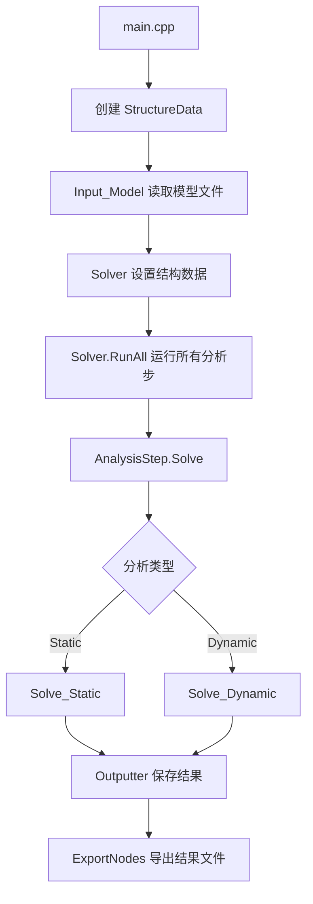

# YQY_CAE 项目说明文档

## 项目概述

YQY_CAE 是一个基于 C++/Qt 的有限元分析（FEA）程序，支持静力分析和动力分析。项目采用模块化设计，具有良好的扩展性。

---

## 1. 项目文件说明

### 1.1 .vcxproj.filters 作用

Visual Studio 中的筛选器文件，用于在解决方案资源管理器中显示虚拟文件夹结构：

```
YQY (项目)
├── 📁 Header Files（头文件）
│   └── YQY.h
├── 📁 Source Files（源文件）  
│   ├── main.cpp
│   └── YQY.cpp
├── 📁 Form Files（界面文件）
│   └── YQY.ui
└── 📁 Resource Files（资源文件）
    └── YQY.qrc
```

> [!NOTE]
> 只用于显示分类，实际文件都在同一个文件夹中

### 1.2 .vcxproj

Visual Studio 项目文件，告诉程序如何编译这个项目，包含编译选项、依赖库等配置。

### 1.3 ThirdPartyLibrary 三方库

直接放置在 D 盘根目录，然后在 VS 中的属性管理器对应的 Debug 或者 Release 中直接添加现有属性表，选择三方库文件夹中对应的属性表即可。

---

## 2. 目录结构

```
YQY/
├── main.cpp                    # 程序入口
├── Base/                       # 基类模块
├── DataStructure/              # 数据结构模块
│   ├── Node/                   # 节点
│   ├── Element/                # 单元（Truss/Cable/Beam）
│   ├── Material/               # 材料
│   ├── Section/                # 截面
│   ├── Property/               # 属性（材料+截面组合）
│   ├── Constraint/             # 约束
│   ├── Load/                   # 荷载
│   ├── AnalysisStep/           # 分析步
│   └── Structure/              # 结构数据容器
├── Solver/                     # 求解器模块
│   ├── Interface/              # 求解器接口
│   ├── Static/                 # 静力求解器
│   └── Dynamic/                # 动力求解器
├── Import/                     # 文件导入模块
├── Export/                     # 结果导出模块
├── GUI/                        # 图形界面模块
├── Utility/                    # 工具类模块
├── Conductor/                  # 导线生成模块
└── TestData/                   # 测试数据
```

---

## 3. 核心模块说明

### 3.1 数据结构模块 (DataStructure)

#### 3.1.1 StructureData - 结构数据容器

文件：`DataStructure/Structure/StructureData.h`

存储和管理整个有限元模型的所有数据：

| 成员 | 类型 | 说明 |
|------|------|------|
| `m_Nodes` | `map<int, Node>` | 节点集合 |
| `m_Elements` | `map<int, ElementBase>` | 单元集合 |
| `m_Material` | `map<int, Material>` | 材料集合 |
| `m_Section` | `map<int, SectionBase>` | 截面集合 |
| `m_Property` | `map<int, Property>` | 属性集合 |
| `m_Constraint` | `map<int, Constraint>` | 约束集合 |
| `m_Load` | `map<int, LoadBase>` | 荷载集合 |
| `m_AnalysisStep` | `map<int, AnalysisStep>` | 分析步集合 |

主要方法：
- `FindNode(id)` / `FindElement(id)` / `FindMaterial(id)` 等 - 查找方法
- `Create_Property(id_material, id_section)` - 创建属性
- `Add_Constraint(...)` - 添加约束
- `Add_Gravity(...)` - 添加重力荷载
- `Add_AnalysisStep(...)` - 添加分析步
- `CleanupModel(tolerance)` - 模型清理（合并重复节点等）

#### 3.1.2 单元类型 (Element)

| 文件 | 类名 | 说明 |
|------|------|------|
| `ElementTruss.h` | `ElementTruss` | 桁架单元（2节点，只承受轴力） |
| `ElementCable.h` | `ElementCable` | 索单元（2节点，只承受拉力） |
| `ElementBeam.h` | `ElementBeam` | 梁单元（2节点，可承受弯矩） |

#### 3.1.3 荷载类型 (Load)

| 文件 | 类名 | 说明 |
|------|------|------|
| `Force_Node.h` | `Force_Node` | 节点力荷载 |
| `Force_Element.h` | `Force_Element` | 单元荷载 |
| `Force_Gravity.h` | `Force_Gravity` | 重力荷载 |
| `Force_Wind.h` | `Force_Wind` | 风荷载 |

#### 3.1.4 AnalysisStep - 分析步

文件：`DataStructure/AnalysisStep/AnalysisStep.h`

负责单次分析的完整流程，实现 `Solver::IAnalysisModel` 接口。

主要参数：
- `m_Type` - 分析类型（Static/Dynamic）
- `m_Time` - 总时间
- `m_StepSize` - 每步大小
- `m_Tolerance` - 收敛容差
- `m_MaxIterations` - 最大迭代次数

主要方法：
- `Init()` - 初始化（DOF编号、矩阵组装）
- `Solve()` - 根据类型调度求解
- `Solve_Static()` - 静力求解
- `Solve_Dynamic()` - 动力求解（调用 SolverNewmark）

---

### 3.2 求解器模块 (Solver)

#### 3.2.1 ISolver - 求解器接口

文件：`Solver/Interface/ISolver.h`

统一的求解器接口，所有求解器都继承此接口。

```cpp
class ISolver {
    virtual bool Solve(IAnalysisModel& model, double duration) = 0;
    virtual const char* GetName() const = 0;
    virtual SolverType GetType() const = 0;
};
```

求解器类型枚举：
- `Static` - 静力 Newton-Raphson
- `Newmark` - Newmark-β 隐式动力
- `CentralDifference` - 中心差分显式动力（预留）
- `HHT` - HHT-α 隐式动力（预留）

#### 3.2.2 SolverStatic - 静力求解器

文件：`Solver/Static/SolverStatic.h`

采用 **Newton-Raphson 迭代法** 进行非线性静力分析。

#### 3.2.3 SolverNewmark - 动力求解器

文件：`Solver/Dynamic/SolverNewmark.h`

采用 **Newmark-β 隐式积分方法** 进行动力分析。

---

### 3.3 文件导入模块 (Import)

#### 3.3.1 Input_Model - 模型输入类

文件：`Import/Input_Model.h`

负责从文件读取有限元模型数据。

主要方法：
- `InputData(fileName, pStructure)` - 读取模型文件
- `InputNodes(...)` - 读取节点
- `InputElement(...)` - 读取单元（分发到具体处理函数）
- `InputMaterial(...)` - 读取材料
- `InputSection(...)` - 读取截面
- `InputConstraint(...)` - 读取约束
- `InputLoad(...)` - 读取荷载
- `InputAnalysisStep(...)` - 读取分析步

#### 3.3.2 输入文件格式

详见：`Import/FileFormat.md`

支持的关键字：
| 关键字 | 说明 |
|--------|------|
| `*NODE` | 节点定义 |
| `*ELEMENT` | 单元定义（T3D2/CABLE/B31） |
| `*MATERIAL` | 材料定义 |
| `*SECTION` | 截面定义 |
| `*CONSTRAINT` | 约束定义 |
| `*LOAD` | 荷载定义（FORCE_NODE/FORCE_ELEMENT/GRAVITY） |
| `*ANALYSIS_STEP` | 分析步定义（STATIC/DYNAMIC） |

---

### 3.4 结果导出模块 (Export)

#### 3.4.1 Outputter - 输出管理器

文件：`Export/Outputter.h`

管理多帧分析结果数据，支持增量式保存。

主要类：
- `DataType` - 数据类型枚举（U1/U2/U3/V1/V2/V3/A1/A2/A3等）
- `NodeData` - 单个节点在某一时刻的数据快照
- `DataFrame` - 单帧数据（某一时间点所有节点的状态）
- `Outputter` - 输出管理器

主要方法：
- `SaveDataFromNodes(time, pData)` - 保存当前时刻数据
- `ExportNodes(fileName, nodeIds, types)` - 导出指定节点的时程数据
- `SaveModel(fileName, pData)` - 导出整个模型数据

---

### 3.5 工具类模块 (Utility)

#### 3.5.1 ModelManager - 模型管理器

文件：`Utility/ModelManager.h`

单例模式，管理程序中的多个模型。

主要方法：
- `Instance()` - 获取单例
- `CreateModel()` - 创建新模型
- `GetModel(id)` - 获取指定模型
- `GetActiveModel()` - 获取当前活动模型
- `SetActiveModel(id)` - 设置活动模型
- `DeleteModel(id)` - 删除模型

#### 3.5.2 EnumKeyword - 关键字枚举

文件：`Utility/EnumKeyword.h`

定义文件解析用的关键字枚举和映射表。

---

### 3.6 导线生成模块 (Conductor)

#### 3.6.1 ConductorLib - 导线库

文件：`Conductor/ConductorLib.h`

用于生成架空输电线路的导线模型，支持：
- 单根导线
- 多分裂导线
- 带间隔棒的导线

---

### 3.7 GUI模块

文件：`GUI/YQY.h`, `GUI/YQY.ui`

基于 Qt 的图形用户界面。

---

## 4. 程序流程



---

## 5. 使用示例

```cpp
// 1. 创建结构数据
auto pStructure = std::make_shared<StructureData>();

// 2. 读取模型文件
Input_Model importer;
importer.InputData("Import/ImportFile/model.bdf", pStructure);

// 3. 运行分析
Solver solver;
solver.SetStructure(pStructure);
solver.RunAll();

// 4. 导出结果
std::vector<int> nodeIds = {1, 2, 3};
std::vector<DataType> types = {DataType::U1, DataType::U2, DataType::U3};
pStructure->GetOutputter().ExportNodes("output.bdf", nodeIds, types);
```

---

## 6. 依赖库

- **Qt** - GUI框架
- **Eigen** - 线性代数库（稀疏矩阵、求解器）

---

## 7. 扩展开发

### 添加新单元类型

1. 在 `DataStructure/Element/` 目录下创建新的单元类
2. 继承 `ElementBase` 基类
3. 实现刚度矩阵、质量矩阵等方法
4. 在 `EnumKeyword.h` 中添加枚举
5. 在 `Input_Model.cpp` 中添加处理函数

### 添加新求解器

1. 在 `Solver/` 目录下创建新的求解器类
2. 继承 `ISolver` 接口
3. 实现 `Solve()` 方法
4. 在工厂函数中注册新求解器
